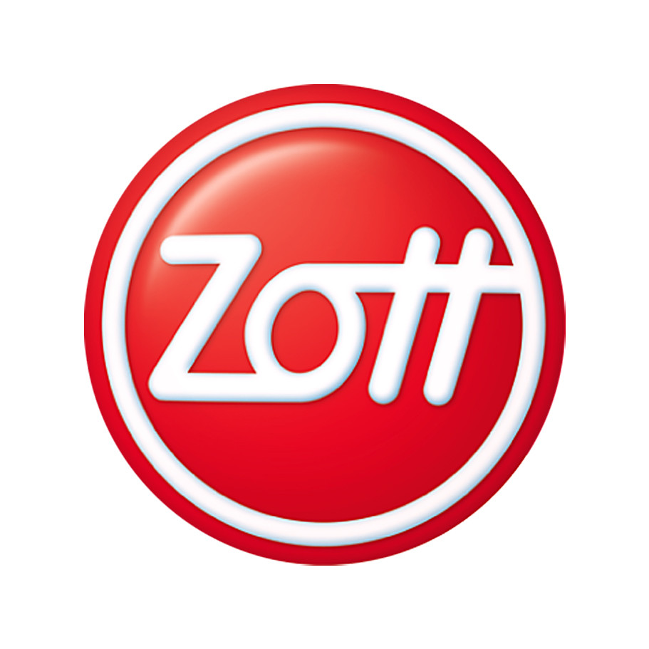

# Logo Zott

Zott SE & Co. KG – międzynarodowe przedsiębiorstwo z branży mleczarskiej, wywodzące się z niemieckiej spółki rodzinnej, której główna siedziba znajduje się w Mertingen, w kraju związkowym Bawaria, w Niemczech.
Obecnie produkty przedsiębiorstwa dostępne są w ponad 75 krajach na całym świecie.

Logo Zott jest to czerwone koło z białym napisem ‘Zott’ i białym okręgiem nachodzącym na drugą literę ‘t’.
Logo Zott na produktach firmy zawsze występuje z nazwą produktu, której napis nachodzi na dolną część loga.
W projekcie skupiono się głównie na jogurtach Jogobella.

# Opis kodu źródłowego

Kod źródłowy jest dostępny pod adresem: [github.com/jedrzejowski/pobr-project](https://github.com/jedrzejowski/pobr-project)

Opisy poszczególnych plików:

 - `src/main.cpp` - głowna pętla programu.
 - `src/findZott.h` - algorytm znajdujący logo
 - `src/color.h` - manipulacja kolorami
 - `src/lib.h` - wczytywanie, zapisywanie i wyświetlanie obrazu
 - `src/calc.h` - różna funkcje obliczeniowe
 - `src/logger.h` - logger
 - `src/types.h` - typy upraszczające deklaracje
 
Wszystkie obliczenia są realizowane na normalizowanych wartościach `0-1` o podwójnej precyzji. 

# Algorytm

## Opis

Na początku obraz jest progowany na wartości czerwone i białe loga.

Z obrazu czerwonego jest poszukiwane koło, środek litery `o`.
Wyliczane są przy tym parametry `W3` i `W4` dla każdego kawałka obrazu.
Jeżeli okaże się, że to może być kształ koła, wyliczany jest jego promień, a następnie brany jest kwadrat obrazu o boku długości 11-krotności promienia koła.

Następnie dodawany jest kwadrat obrazu czerwonego i białego oraz sprawdzany czy jest dostatecznie wypełniony.
Dalej szukamy białego obiektu, który spełnia zależność `L/S < 1`, gdzie `L` to obwód, a `S` to pole, parametr znaleziony doświadczalnie.

W ostatnim kroku znajdujemy kawałki czerwieni o polu od 3% do 10% powierzchni względem kwadratu i oddalone od środka o 5-krotność promienia koła.

## Wyjaśnienia

Logo Zott jest wysoce nie stabilne.
Poszczególne litery lubią się zlewać z białą obwódką i z innymi literami, sprawiając, że współczynniki kształtu są praktycznie bezużyteczne.
Skutkuje to też zmienną ilością elementów.
Nie pomaga fakt, że w logo znajdują się dość mocne gradienty. 

# Przykładowe wyniki

